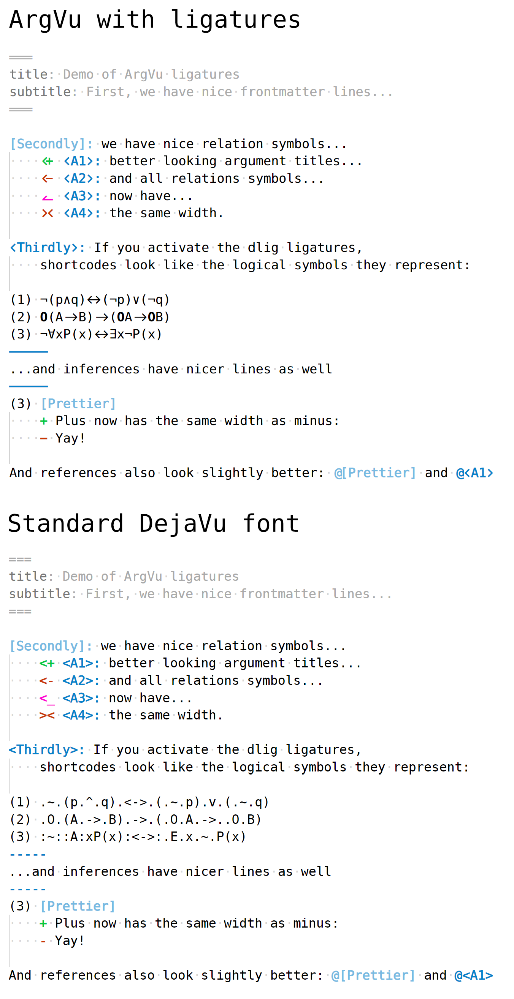

# ArgVu - A font for Argdown

ArgVu is a font that adds Argdown-specific font ligatures and glyphs to [DejaVu Sans Mono](https://dejavu-fonts.github.io/). ArgVu is not required for using Argdown, it's only purpose is to make Argdown look even prettier. Here is an example:



Check out ArgVu in the [Argdown Sandbox](https://argdown.org/sandbox) by selecting the "Use ArgVu font" checkbox above the code editor.

ArgVu is designed by [Peter Stahmer](http://peterstahmer.de/), funded by the [KIT Debatelab](http://debatelab.philosophie.kit.edu/) and published under a [free license](https://github.com/christianvoigt/argdown/tree/master/packages/ArgVu/LICENSE.md) (based on DejaVu's license).

## Features

We made the following changes to DejaVu Sans Mono:

- Ligatures for relation symbols (`<+`, `<-`, `<_`, `+>`, `->`, `_>` and `><`)
- Ligatures for frontmatter section and inferences (`---` and `===`)
- Larger width for `-` (same as `+`)
- Reduced width for `<` and `>` for better argument titles
- Ligature for statement and argument references (`@[` and `@<`)
- Ligatures for shortcodes of logical symbols (see next section)

The ligatures are defined in the "lig" and "dlig" font features. The "lig" feature is for standard ligatures that will be automatically activated if your text editor supports ligatures.

The "dlig" feature is for "discretionary ligatures" and has to be activated specifically. It contains the ligatures for shortcodes of logical symbols.

### "Magical" ligatures for logical symbols

The "dlig" feature contains ligatures for the following shortcodes:

- and: `:^:` or `.^.`
- or: `:v:` or `.v.`
- not: `:~:` or `.~.`
- implies: `:->:` or `.->.`
- biconditional: `:<->:` or `.<->.`
- universal quantifier: `:A:` or `.A.`
- existential quantifier: `:E:` or `.E.`
- necessary: `:[]:` or `.[].`
- possible: `:<>:` or `.<>.`
- obligatory: `:O:` or `.O.`
- permissible: `:P:` or `.P.`

Argdown will display these shortcodes directly as the logical symbols they are representing (so :A: will look like ∀ and :<->: will look like ↔), _without changing the underlying code_. This magical transformation is a matter of taste. While some users might find it very useful, others might find it offensive (because three glyphs are looking as if they were one glyph), so we did put it into the "discretionary ligatures" feature of ArgVu. If you want to try it out, you have to activate this feature in your text editor (see next section).

## Using ArgVu in VS Code

To activate ArgVu and its ligatures for Argdown documents in VS Code do the following:

1. [Download ArgVu](https://github.com/christianvoigt/argdown/raw/master/packages/ArgVu/ArgVuSansMono-Regular-8.2.otf) and install it in your system
2. Start VS Code and open the settings.
3. Click on the "Open Settings (JSON)" button on the top right, beside the tab menu to edit the settings as a JSON text document.
4. Add the following to the JSON file:

```json
    "[argdown]": {
        "editor.fontLigatures": "'dlig'",
        "editor.fontFamily": "ArgVu Sans Mono Regular"
    },
```

If you only want to use the standard ligatures and **not** the "magical" font ligatures for the shortcodes, use `"editor.fontLigatures":true` instead.
